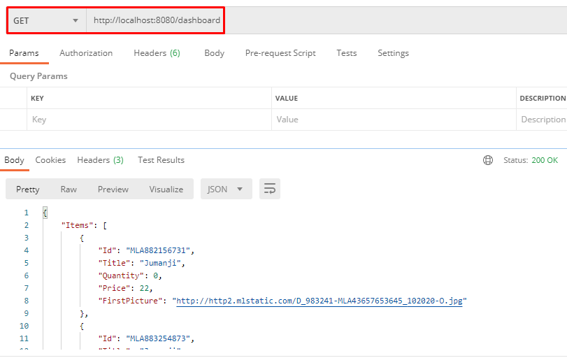
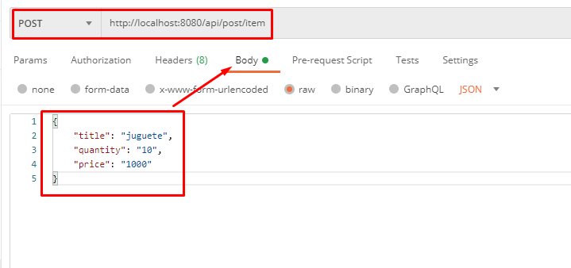

# go-meli-integration

Aplicacion en Go para interactuar por medio de un cliente


##Instalación
* Para clonar el proyecto
```
git clone https://github.com/franciscolmos/go-meli-integration.git
```

* Descargar dependencias desde la terminal
```
$ go get
```

##Modo de uso
* Cerrar sesión de mercadolibre
* Ejecutar programa
```
$ go run main.go 
```

* Levantar el proyecto de Angular: https://github.com/franciscolmos/go-meli-integration-client
* Una vez que este corriendo el servidor del cliente, colocar en la url:
```
http://localhost:4200/home 
```

* Clickear en el boton Iniciar con MercadoLibre

* Iniciar sesión con el siguiente usuario de Test
```
USUARIO VENDEDOR
{
 "id": 651268893,
 "nickname": "TESTM9POOMFL",
 "password": "qatest4000",
 "site_status": "active",
 "email": "test_user_6272567@testuser.com"
}
```

* Para hacer las consultas desde Postman
    * El siguiente request es para obtener los items publicados por el vendedor, las ventas realizadas y las preguntas sin responder de cada item publicado.
```
http://localhost:8080/api/dashboard

```
Se visualiza de la siguiente forma:
 
 
* Publicar item
```
http://localhost:8080/api/post/item

BODY: 
{
    "title": "nombre de ITEM",
    "quantity": "cantidad de ITEMS",
    "price": "precio del ITEM"
}

```
Se visualiza de la siguiente forma:


#### USUARIOS COMPRADORES
* Estos usuarios son los que utilizamos para realizar las compras de los items desde la plataforma de Mercado Libre.
```
USUARIO COMPRADOR 1
{
    "id": 668649307,
    "nickname": "TETE9374393",
    "password": "qatest108",
    "site_status": "active",
    "email": "test_user_84351449@testuser.com"
}

USUARIO COMPRADOR 2
{
    "id": 671219465,
    "nickname": "TETE9724067",
    "password": "qatest132",
    "site_status": "active",
    "email": "test_user_77907779@testuser.com"
}
```
 
 